# CanLab — AI-Powered CAN Bus Reverse Engineering Workstation

[](https://www.python.org)
[](https://pypi.org/project/PyQt6/)
[](LICENSE)
[](https://www.anthropic.com)
[](https://groq.com)
[](https://en.wikipedia.org/wiki/CAN_bus)

> **The most complete open-source CAN bus reverse engineering platform ever built.**
> 14 analysis tabs. Dual AI engines. Real-time ML signal detection. OBD-II live gauges. AUTOSAR ARXML export. All in a dark-themed desktop GUI.

---

## What Is CanLab?

CanLab is a professional-grade desktop application for **automotive CAN bus analysis, reverse engineering, and signal decoding**. Whether you are a security researcher, automotive engineer, openpilot developer, or hobbyist exploring your vehicle's network, CanLab gives you every tool you need in a single, unified workstation.

It combines **Claude AI and Groq LLaMA** with **7 purpose-built machine learning algorithms** to automatically classify signals, detect checksums, identify rolling counters, correlate IDs, and supercharge every AI prompt with offline-derived facts. It connects to any python-can compatible hardware, comma.ai Panda, or virtual CAN interfaces. It reads SavvyCAN CSV logs, candump logs, openpilot rlogs, and CAN FD logs. It exports to DBC, openpilot DBC, Vector CANdb++, AUTOSAR ARXML, Wireshark Lua dissectors, and Python/C code.

**Repository:** [https://github.com/Sherin-SEF-AI/CanLab.git](https://github.com/Sherin-SEF-AI/CanLab.git)
**Author:** Sherin Joseph Roy — sherin.joseph2217@gmail.com

---

## Table of Contents

- [Feature Overview](#feature-overview)
- [Screenshots and Interface](#screenshots-and-interface)
- [Installation](#installation)
- [Quick Start](#quick-start)
- [All 14 Tabs — Complete Feature Reference](#all-14-tabs--complete-feature-reference)
  - [FRAMES Tab](#1-frames-tab)
  - [SIGNALS Tab](#2-signals-tab)
  - [PLOT Tab](#3-plot-tab)
  - [AI ENGINE Tab](#4-ai-engine-tab)
  - [DBC BUILDER Tab](#5-dbc-builder-tab)
  - [CODE GEN Tab](#6-code-gen-tab)
  - [INTELLIGENCE Tab](#7-intelligence-tab)
  - [INJECTION Tab](#8-injection-tab)
  - [DIAGNOSTICS Tab](#9-diagnostics-tab)
  - [DASHBOARD Tab](#10-dashboard-tab)
  - [AUTO-RE Tab](#11-auto-re-tab)
  - [TIMELINE Tab](#12-timeline-tab)
  - [OBD-II Tab](#13-obd-ii-tab)
  - [ML INTEL Tab](#14-ml-intel-tab)
- [AI Engine — Claude and Groq](#ai-engine--claude-and-groq)
- [Machine Learning Features](#machine-learning-features)
- [Live CAN Bus Connection](#live-can-bus-connection)
- [Log File Formats](#log-file-formats)
- [Export Formats](#export-formats)
- [REST API](#rest-api)
- [Plugin System](#plugin-system)
- [Settings and Configuration](#settings-and-configuration)
- [Keyboard Shortcuts](#keyboard-shortcuts)
- [Architecture](#architecture)
- [Contributing](#contributing)
- [License](#license)

---

## Feature Overview

| Category | Features |
|---|---|
| **AI Analysis** | Claude Sonnet streaming, Groq LLaMA streaming, natural language CAN queries, persistent AI memory, ML context supercharger |
| **Machine Learning** | Byte role classifier, checksum reverse engineer, cross-ID correlation engine, change-point detector, anomaly detector, periodicity classifier, embedding-based signal search |
| **Signal Analysis** | Entropy boundary detection, counter/checksum auto-detection, periodicity analysis, diff engine, value reverse lookup |
| **Live CAN** | python-can (SocketCAN, PCAN, Kvaser, Virtual), comma.ai Panda, CAN FD up to 64 bytes, multi-bus |
| **Diagnostics** | OBD-II Mode 01 scanning (26 PIDs), UDS deep scan, UDS service discovery, ISO-TP sessions, J1939 PGN decoder, bus load metering, bus health monitoring |
| **Injection and Replay** | Signal injection with loop and period, replay with scrubber and loop, trigger rules, safety scanner with watchdog, CAN fuzzer (random/sequential/mutation), test sequences |
| **DBC Ecosystem** | DBC import/export, openpilot DBC export, Vector CANdb++ export, AUTOSAR ARXML export/import, Wireshark Lua dissector export, opendbc cross-reference |
| **Code Generation** | Python (python-can), C (SocketCAN), Hyundai/openpilot signal readers |
| **Intelligence** | Vehicle fingerprinting, auto-DBC generation, log diff, community profiles sync, GitHub repo fetch, change-on-action detection |
| **OBD-II Live** | 26-PID gauge dashboard, auto-discover supported PIDs, live streaming gauges (RPM, speed, coolant, MAF, throttle, fuel, voltage, and more) |
| **Export** | DBC, openpilot DBC, CANdb++, ARXML, Lua, Python, C, JSON |
| **Formats** | SavvyCAN CSV, candump log, openpilot rlog/qlog, CAN FD log |
| **REST API** | GET /frames, GET /signals, GET /status, POST /inject, GET /memory |
| **UI** | Dark theme, animated status bar, sparklines, byte heatmaps, pyqtgraph live plots, pulsing CAN indicator |

---

## Screenshots and Interface

### Main Window — FRAMES Tab
Loaded with Hyundai Kona sample drive data. The left panel shows the CAN ID list with frequency and frame count. The center table shows every raw frame with byte-level delta highlighting.


### FRAMES Tab — Raw Frame View
Every frame shown with TIMESTAMP, ID, BUS, DLC, and all 8 data bytes. Changed bytes are highlighted green. Delta column shows the per-frame byte change rate.

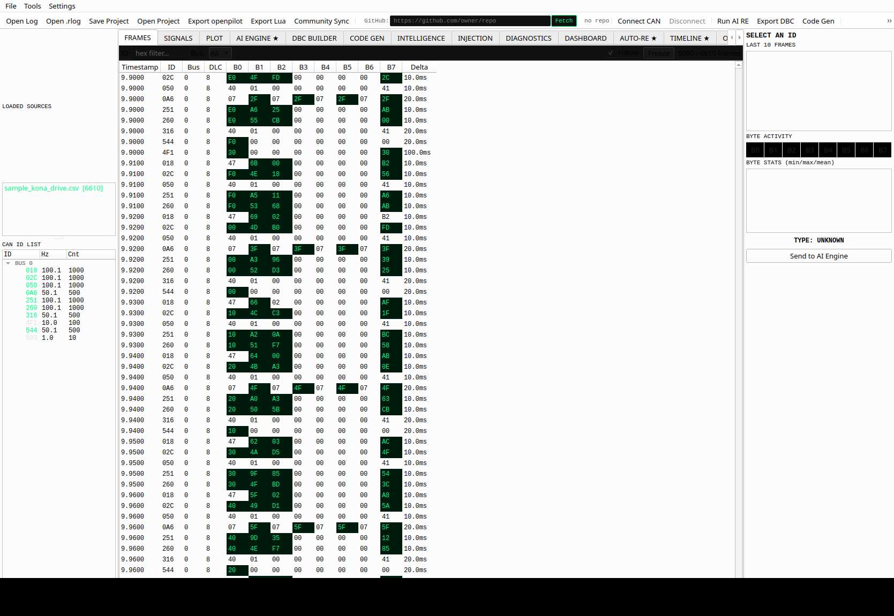

### SIGNALS Tab — DBC-Decoded Signals
Live signal values decoded from the loaded DBC definition. Shows signal name, raw value, physical value, unit, and min/max bounds.

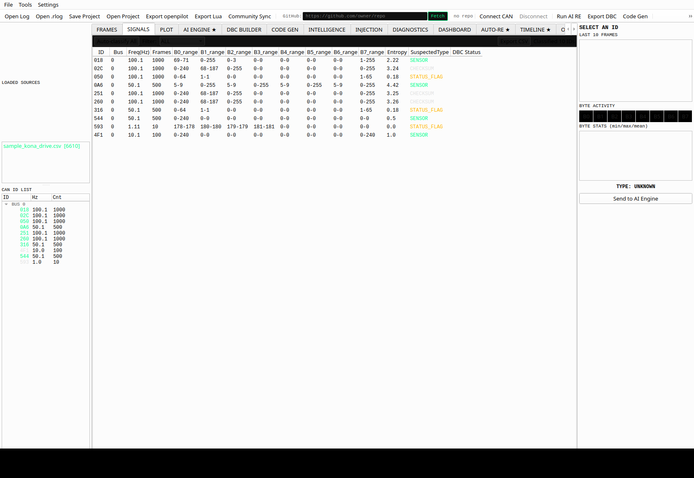

### PLOT Tab — Multi-Signal Time Series
Matplotlib plot with multi-ID, multi-byte traces. Mouse-wheel zoom, right-click context menu, and live update while data streams.

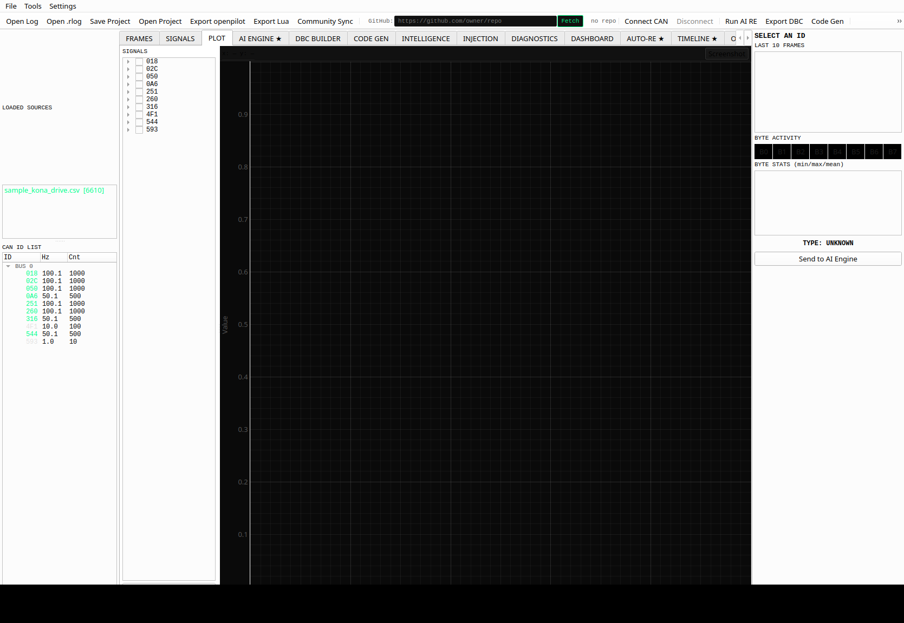

### AI ENGINE Tab — Streaming AI Analysis
Send any CAN ID to Groq LLaMA or Claude AI for reverse-engineering analysis. The ML Context Supercharger injects byte roles, checksum findings, and similar IDs into every prompt automatically.

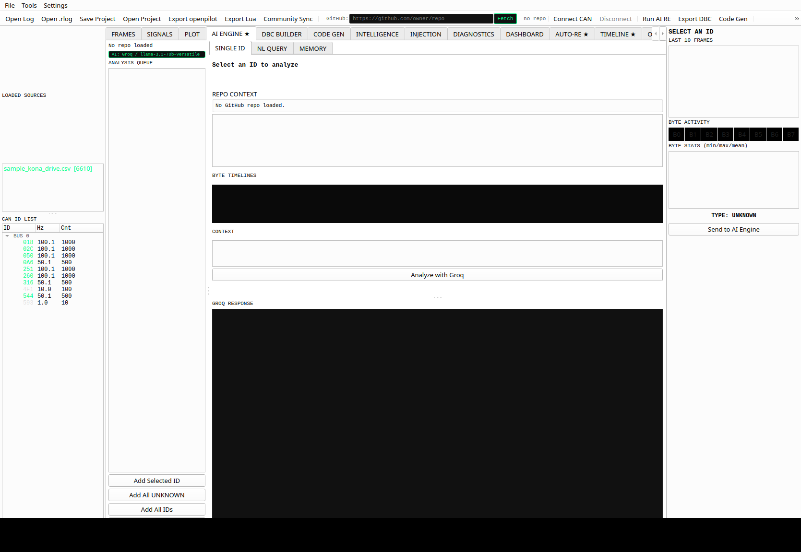

### DBC BUILDER Tab — Signal Definition Editor
Build and edit CAN signal definitions visually. Export to DBC, openpilot DBC, Vector CANdb++, AUTOSAR ARXML, and Wireshark Lua dissector.

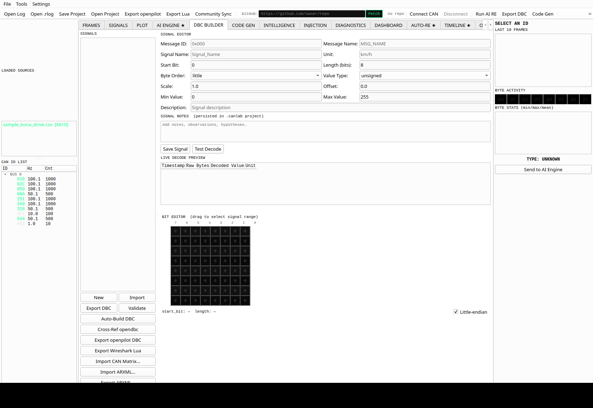

### CODE GEN Tab — Python and C Code Generator
Auto-generate production-ready Python or C parsing code from your DBC signal definitions.

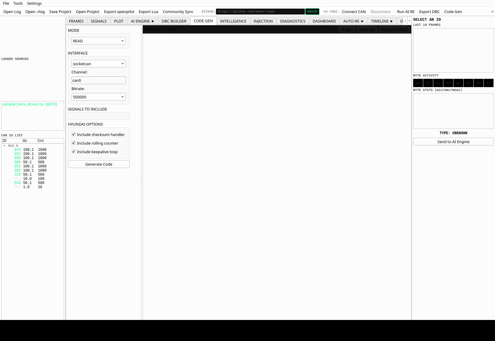

### INTELLIGENCE Tab — Cross-ID Correlation and Embedding Search
Find related signals across different CAN IDs using Pearson correlation and embedding-based cosine similarity search.

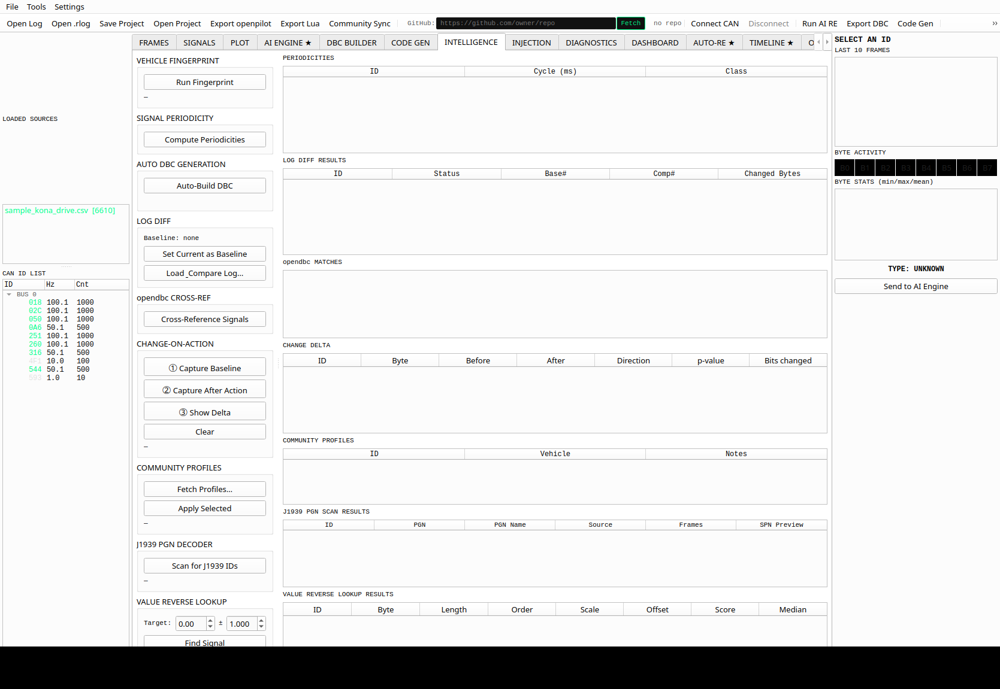

### INJECTION Tab — Frame Injection, Replay, and Fuzzer
Send raw frames, replay captured logs with speed control and scrubber, fuzz signals across ID ranges, and set trigger rules.

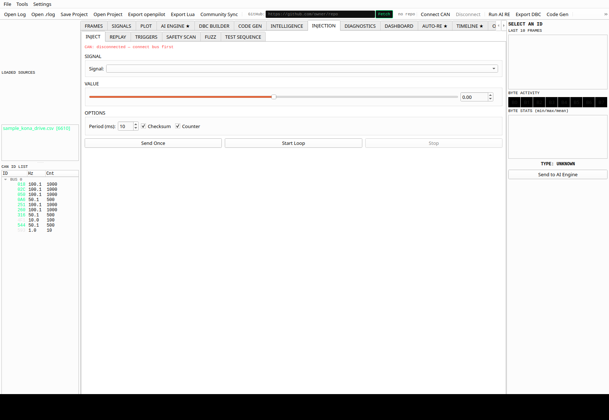

### DIAGNOSTICS Tab — UDS and OBD-II Scanner
Full UDS service discovery, ISO-TP session management, J1939 PGN decoder, and OBD-II Mode 01 PID scanner.

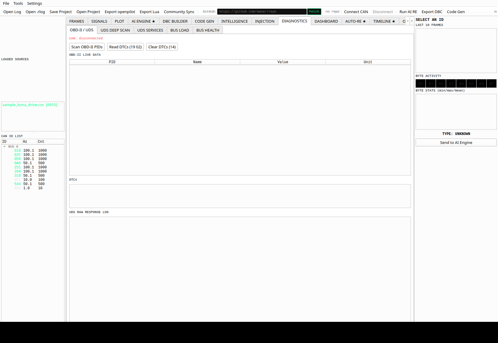

### DASHBOARD Tab — Live Gauge Dials
Animated half-arc gauges for speed, RPM, and any signal decoded from the DBC. Updates at the CAN frame rate.

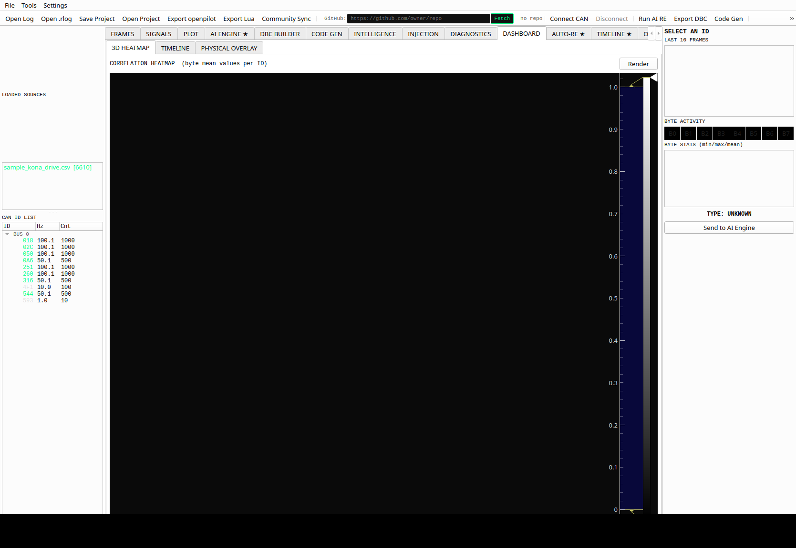

### AUTO-RE Tab — Automatic Counter and Checksum Detection
One-click detection of rolling counter bytes and checksum bytes across all loaded IDs. Tests 9 algorithms with confidence scoring.

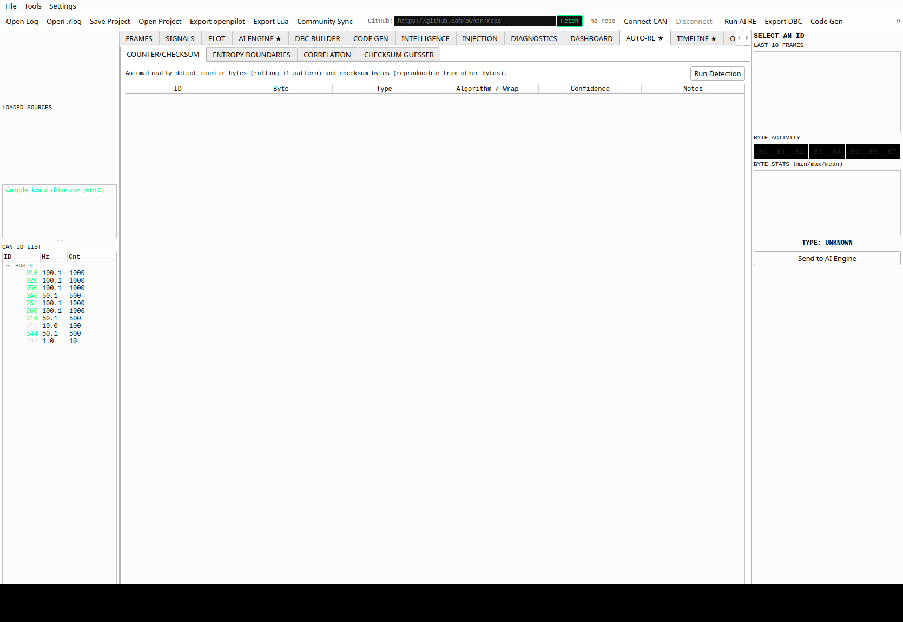

### TIMELINE Tab — Multi-ID Event Timeline
Scrubable timeline with per-ID rows showing frame density, signal change events, and user annotations.

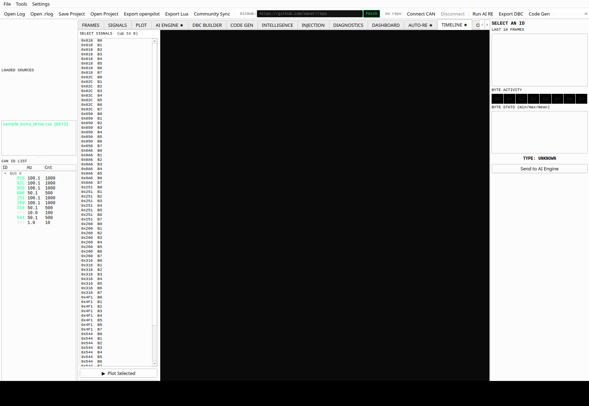

### OBD-II Tab — Live PID Gauge Dashboard
26-PID live gauge grid. Auto-discovers supported PIDs via Mode 01 PID 0x00. Real-time gauge update with configurable polling rate.

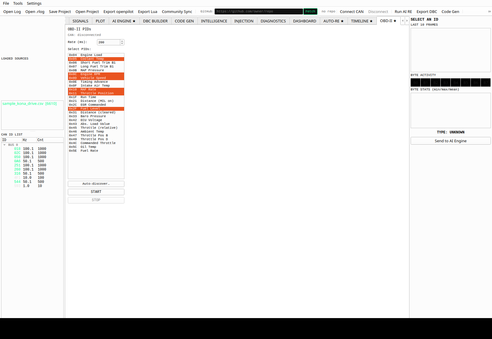

### ML INTEL Tab — Machine Learning Signal Intelligence
Signal embedding search, byte role classification, cross-ID correlation heatmap, anomaly detection, and change-point detection — all offline, no API required.

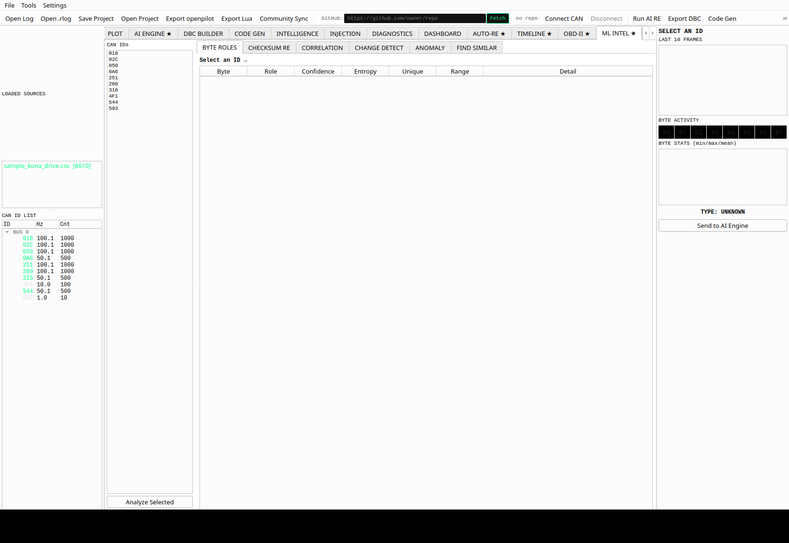

---

## Installation

### System Requirements

- Python 3.11 or newer
- Linux (Ubuntu 20.04+), macOS 12+, or Windows 10+
- 4 GB RAM minimum (8 GB recommended for ML features)
- CAN interface hardware (optional — virtual CAN works without hardware)

### Step 1 — Clone the Repository

```bash
git clone https://github.com/Sherin-SEF-AI/CanLab.git
cd CanLab
```

### Step 2 — Create a Virtual Environment

```bash
python3 -m venv venv
source venv/bin/activate        # Linux / macOS
venv\Scripts\activate.bat       # Windows
```

### Step 3 — Install Dependencies

```bash
pip install --upgrade pip
pip install -r requirements.txt
```

**requirements.txt includes:**

```
PyQt6>=6.6.0
pyqtgraph>=0.13.0
python-can>=4.3.0
cantools>=39.0.0
anthropic>=0.25.0
pandas>=2.0.0
numpy>=1.24.0
requests>=2.31.0
keyring>=24.0.0
scipy>=1.11.0
```

### Step 4 — Optional Dependencies

**For Groq AI support (free, fast inference):**
```bash
pip install groq
```

**For anomaly detection with Isolation Forest:**
```bash
pip install scikit-learn
```

**For comma.ai Panda hardware:**
```bash
pip install panda
```

**For virtual CAN on Linux (testing without hardware):**
```bash
sudo modprobe vcan
sudo ip link add dev vcan0 type vcan
sudo ip link set up vcan0
```

### Step 5 — Set Up API Keys

**Option A — Using the Settings dialog (recommended):**
1. Launch CanLab
2. Go to **Settings > API Keys**
3. Paste your Anthropic API key and/or Groq API key
4. Keys are stored securely in the system keyring

**Option B — Environment variables:**
```bash
export ANTHROPIC_API_KEY="sk-ant-..."
export GROQ_API_KEY="gsk_..."
```

**Get API keys:**
- Anthropic (Claude): [https://console.anthropic.com](https://console.anthropic.com)
- Groq (free tier available): [https://console.groq.com](https://console.groq.com)

### Step 6 — Launch CanLab

```bash
cd canvasre
python3 main.py
```

---

## Quick Start

### Load a Log File and Analyze with AI

1. **File > Open Log** — select a SavvyCAN `.csv` or candump `.log` file
2. Click any ID in the **ID Panel** on the left to select it
3. Right-click the ID and choose **Analyze with AI**
4. The app switches to the **AI ENGINE** tab with the ID loaded
5. Click **Analyze with AI** (or press Enter) to stream the analysis

### Connect to Live CAN Bus

1. Open **Settings > CAN Interface**
2. Set interface type: `socketcan`, `pcan`, `kvaser`, or `virtual`
3. Set channel (e.g. `can0`) and bitrate (e.g. `500000`)
4. Click **Connect** in the toolbar
5. Frames appear live in the FRAMES tab and the ID panel updates in real-time

### Run ML Signal Analysis

1. Load any log file
2. Go to the **ML INTEL** tab (last tab)
3. Select an ID from the list on the left
4. Click **Analyze Selected** to classify byte roles, detect checksums, run periodicity analysis
5. Click **Export to DBC Context** to send ML findings directly to the AI engine

---

## All 14 Tabs — Complete Feature Reference

### 1. FRAMES Tab

The raw frame viewer. Every CAN frame captured or loaded appears here in a sortable, filterable table.

**Columns:** Timestamp, ID, Extended (29-bit flag), Direction, Bus, DLC, B0 through B7

**Features:**
- Real-time frame streaming from live CAN connection
- Filter by ID, bus number, or byte value
- Column sorting (click headers)
- Frame count and capture rate in status bar
- Multi-source support — load multiple log files simultaneously, each source shown with a distinct color tag

**How to use:**
1. Load a log or connect to live CAN
2. Click any column header to sort
3. Use the filter box at the top to narrow frames by ID (e.g. type `018` to show only 0x018)
4. Double-click a row to jump to that ID in the ID Panel

---

### 2. SIGNALS Tab

Decoded signal view using active DBC definitions. Shows human-readable physical values alongside raw hex.

**Features:**
- Decoded value column (physical units: km/h, deg, rpm, etc.)
- Signal name from loaded or built DBC
- Scale and offset display
- Live update from streaming CAN
- Click a signal row to jump to the AI ENGINE with that ID pre-loaded

**How to use:**
1. Load or build a DBC (see DBC BUILDER tab)
2. Load a log or connect live
3. SIGNALS tab shows decoded physical values for every matched signal
4. Right-click a signal for "Analyze with AI" shortcut

---

### 3. PLOT Tab

Time-series visualization of any byte or decoded signal, powered by pyqtgraph for GPU-accelerated rendering.

**Features:**
- Multi-byte overlay (up to 8 byte traces per ID)
- Zoom, pan, and crosshair cursor
- Highlight specific IDs from the ID panel
- Color-coded traces per byte
- Time axis in seconds from log start
- Live scrolling when connected to CAN bus

**How to use:**
1. Click an ID in the ID Panel (left sidebar)
2. The PLOT tab automatically updates with byte traces for that ID
3. Right-click the plot area for zoom controls
4. Use the mouse wheel to zoom in/out on the time axis

---

### 4. AI ENGINE Tab

The central AI analysis hub. Send any CAN ID to Claude Sonnet or Groq LLaMA for streaming reverse-engineering analysis.

**Sub-tabs:** SINGLE ID analysis, NL QUERY (natural language), MEMORY viewer

#### SINGLE ID Analysis

**Features:**
- Streaming AI response with typewriter cursor animation
- ML Context Supercharger: byte roles, checksum findings, and similar IDs injected automatically into every prompt
- Persistent AI memory: previous analyses are included as context for future sessions
- Event correlation: annotated events from README files linked to specific frames
- GitHub repo context: load a vehicle-specific GitHub repo for OEM-specific knowledge
- Accept to DBC: parse the AI response and create a DBC signal entry in one click
- Accept Name: extract signal name from AI response and create a DBC entry
- Re-analyze: run AI again on the same ID (memory accumulates)
- Save to Memory: persist the analysis result for future sessions

**How to use:**
1. Select an ID in the ID Panel and right-click "Analyze with AI"
2. The AI ENGINE tab shows: ID header, frame stats, raw hex preview, byte sparklines
3. Add context (optional): type notes in the Context box ("this changes when brake is pressed")
4. Click **Analyze with AI**
5. The response streams in real-time — watch the analysis appear token by token
6. Click **Accept to DBC** to create a signal entry from the response
7. Click **Save to Memory** to persist the findings

**ML Context Supercharger:**

Before every AI call, CanLab runs offline ML analysis and injects the results into the prompt:
- Byte roles: COUNTER, CHECKSUM, BOOLEAN, PHYSICAL, PADDING (with confidence %)
- Message type: CYCLIC vs EVENT, period in ms, jitter %
- Checksum algorithm: XOR8, SUM8, CRC8-SAE, HYUNDAI_FULL, etc. with confidence %
- Similar IDs: cosine similarity search across all IDs in the log

This means Claude receives structured, factual data about the signal before it reasons, leading to dramatically more accurate results.

#### NL QUERY — Natural Language

Ask questions in plain English about your entire CAN dataset.

**Examples:**
- "Which signal changes when the brake pedal is pressed?"
- "What is the steering angle ID and its scaling factor?"
- "Find all IDs that change at exactly 10ms intervals"
- "Which IDs have high entropy in byte 7 suggesting a checksum?"

**How to use:**
1. Switch to the **NL QUERY** sub-tab
2. Type your question and press Enter or click **Ask Claude**
3. The AI reasons across all IDs, frame statistics, and prior memory

#### MEMORY Viewer

All saved analyses persist across sessions in a local JSON file.

**How to use:**
1. Switch to the **MEMORY** sub-tab
2. View all prior analyses with timestamps and IDs
3. Click **Clear Memory** to reset

#### Analysis Queue

**How to use:**
1. Click **Add All UNKNOWN** to queue every ID without a known signal type
2. Click **Add All IDs** to queue everything
3. Click **Run Queue** to batch-analyze all queued IDs sequentially
4. Progress bar shows completion; each result is auto-saved to memory

---

### 5. DBC BUILDER Tab

Build, edit, import, and export DBC signal definitions with a full graphical editor.

**Features:**
- Signal table: message ID, message name, signal name, start bit, length, byte order, value type, scale, offset, min, max, unit, description
- Add / Edit / Delete signals
- Auto-Build DBC: one click generates DBC entries for all detected signals using the ML analyzer
- Import DBC: load an existing `.dbc` file
- Export DBC: standard `.dbc` format (cantools-compatible)
- Export openpilot DBC: openpilot-formatted DBC with Hyundai-specific attributes
- Export CANdb++: Vector CANdb++ format with `BA_DEF_`, `BA_DEF_DEF_`, and `BA_` attribute blocks
- Export ARXML: AUTOSAR 4.3 System Template with I-SIGNAL, I-SIGNAL-I-PDU, CAN-FRAME, and COMPU-METHOD elements
- Import ARXML: import AUTOSAR ARXML back into the signal table
- Export Lua: Wireshark Lua dissector script generated directly from DBC signals
- Import CAN Matrix: import signals from Excel or CSV format

**How to use — Build from scratch:**
1. Go to **DBC BUILDER**
2. Click **Auto-Build DBC** to auto-detect signals from the loaded log
3. Review and edit each signal in the table (double-click to edit)
4. Click **Export DBC** to save as `.dbc`

**How to use — Import existing DBC:**
1. Click **Import DBC**
2. Select your `.dbc` file
3. All signals appear in the table for review and editing

**How to use — Export CANdb++:**
1. Build or import your signals
2. Click **Export CANdb++**
3. Save the `.dbc` file — it includes all CANdb++ attribute blocks and is parseable by Vector tools and cantools

**How to use — Export ARXML:**
1. Build or import your signals
2. Click **Export ARXML**
3. Save the `.arxml` file — AUTOSAR 4.3 compatible, importable into Vector DaVinci Developer, ETAS ISOLAR, and other OEM toolchains

**How to use — Import ARXML:**
1. Click **Import ARXML**
2. Select an `.arxml` file from any AUTOSAR toolchain
3. Signals are parsed and added to the signal table automatically

---

### 6. CODE GEN Tab

Generate ready-to-run code from your DBC signals.

**Supported languages and modes:**
- **Python (python-can):** threaded CAN reader with decoded signal values
- **C (SocketCAN):** low-level C code with `read()`, `write()`, and signal decode macros
- **Hyundai/openpilot style:** Python reader formatted for openpilot fork development

**Options:**
- Select interface type and channel
- Choose which signals to include
- Hyundai-specific options: include rolling counter and checksum handling

**How to use:**
1. Build your DBC signals in DBC BUILDER
2. Go to **CODE GEN**
3. Select mode (Python / C / Hyundai)
4. Configure interface (e.g. `socketcan`, `can0`, `500000`)
5. Click **Generate**
6. Copy the output or click **Save to File**

---

### 7. INTELLIGENCE Tab

Seven advanced analysis panels in one tab.

#### Vehicle Fingerprint

Matches your observed CAN ID set against a database of known vehicle profiles to identify the vehicle model automatically.

**How to use:**
1. Load a log or connect live
2. Click **Run Fingerprint**
3. The best matching vehicle profile appears with a confidence score

#### Signal Periodicity

Detects the transmission period of every CAN ID: HIGH-FREQ (less than 15ms), MID-FREQ (15 to 100ms), LOW-FREQ (more than 100ms), or EVENT-driven.

**How to use:**
1. Load a log
2. Click **Analyze Periodicity**
3. A table shows every ID with its measured period, jitter percentage, and classification

#### Auto DBC Generation

Runs the signal analyzer across all IDs and generates DBC entries automatically based on entropy, range, and pattern detection.

**How to use:**
1. Load a log
2. Click **Auto-Generate DBC**
3. Review the generated entries — they appear in the DBC BUILDER tab

#### Log Diff

Compare two log files or a current log against a baseline to find what changed.

**How to use:**
1. Click **Set Baseline** to snapshot the current log
2. Load a new log (e.g. "with brake pressed")
3. Click **Run Diff**
4. Changed bytes are highlighted with magnitude and direction

#### opendbc Cross-Reference

Matches your detected signals against the opendbc open-source DBC database (Hyundai, Toyota, Honda, GM, Ford, and hundreds more).

**How to use:**
1. Click **Cross-Reference opendbc**
2. Matching signal names and definitions appear with source DBC paths

#### Change-on-Action

Records which bytes change when you perform a vehicle action (press brake, turn wheel, etc.).

**How to use:**
1. Click **Start Recording**
2. Perform the action in the vehicle
3. Click **Stop**
4. See which IDs and bytes changed with timestamp correlations

#### J1939 PGN Decoder

Identifies J1939 messages (29-bit extended IDs) and decodes PGNs and SPNs from the commercial vehicle standard.

**How to use:**
1. Load a log containing J1939 traffic (IDs greater than 0x7FF)
2. Click **Scan for J1939 IDs**
3. PGN names, SPN values, and source addresses appear in the table

#### Value Reverse Lookup

Enter a known physical value (e.g. vehicle speed = 60 km/h) and CanLab searches all signals to find which byte or combination matches that value at the right timestamps.

**How to use:**
1. Enter the known physical value and unit
2. Enter the approximate timestamp
3. Click **Search**
4. Candidates are ranked by correlation score

#### Community Profiles

Sync and load crowd-sourced vehicle profiles from the community repository.

**How to use:**
1. Click **Sync Profiles**
2. Select your vehicle make and model
3. Known signal definitions load into the DBC BUILDER automatically

---

### 8. INJECTION Tab

Six sub-tabs for advanced CAN bus manipulation and testing.

#### INJECT Sub-tab

Send custom CAN frames or continuously inject signals at a set period.

**How to use:**
1. Connect to a live CAN bus
2. Select the signal from your DBC list
3. Set the value to inject
4. Set the period in milliseconds (e.g. 10ms for 100Hz)
5. Click **Start Injection**
6. Click **Stop Injection** to halt

#### REPLAY Sub-tab

Play back a recorded log onto the CAN bus with full timing fidelity.

**Features:**
- Speed control: 0.1x to 10x
- Loop mode: replay continuously
- Scrubber: drag to any position in the log
- Extended ID support: 29-bit IDs replayed correctly
- Status log: shows loop iteration count

**How to use:**
1. Connect to a live CAN bus (or virtual CAN)
2. Click **Load Log** and select your log file
3. Check **Loop** if you want continuous replay
4. Click **Play**
5. Drag the scrubber to jump to any point in the log
6. Click **Pause** / **Stop** as needed

#### TRIGGERS Sub-tab

Define rules that fire when specific byte values are detected on the bus.

**How to use:**
1. Set ID (hex, leave blank for any)
2. Set byte index (0 to 7)
3. Set operation: `>`, `<`, `==`, `!=`, `&`, `>=`, `<=`
4. Set value (0 to 255)
5. Add a label
6. Click **Add** then **Enable Triggers**
7. When a matching frame arrives, the trigger log records the event with a timestamp

#### SAFETY SCAN Sub-tab

Sweep a signal through its full value range and monitor for safety cutouts.

**How to use:**
1. Select the signal to sweep
2. Set min, max, and step values
3. Set the safety threshold and watchdog timeout
4. Click **Start Safety Scan**
5. If a cutout is detected, the scan stops and logs the value that triggered it

#### FUZZ Sub-tab

Randomize CAN frame payloads to stress-test ECU responses.

**Modes:** Random, Sequential, Mutation

**How to use:**
1. Connect to live CAN
2. Enter the target ID (hex)
3. Set DLC (1 to 8)
4. Select fuzz mode
5. Set the delay between frames
6. Click **Start Fuzzing**
7. Watch for unexpected ECU responses in the FRAMES tab

#### TEST SEQUENCE Sub-tab

Build and run scripted multi-step test sequences.

**How to use:**
1. Add steps: Inject, Delay, Assert, Expect
2. Set parameters for each step
3. Click **Run Sequence**
4. Results appear per step with pass/fail indication

---

### 9. DIAGNOSTICS Tab

Five sub-tabs for protocol-level vehicle diagnostics.

#### OBD-II / UDS Sub-tab

Scan for supported OBD-II PIDs and read live values.

**How to use:**
1. Connect to a vehicle OBD-II port via a CAN adapter
2. Click **Scan OBD-II PIDs**
3. Supported PIDs are detected automatically
4. Values appear in the table (RPM, speed, coolant temp, fuel level, etc.)

#### UDS DEEP SCAN Sub-tab

Scan all 256 UDS service IDs across configurable ECU address ranges.

**How to use:**
1. Set ECU address (default 0x7DF)
2. Set timeout and retry count
3. Click **Start Deep Scan**
4. Responding services are listed with their response codes

#### UDS SERVICES Sub-tab

Send individual UDS requests: Read Data By Identifier, Write Data, ECU Reset, Security Access, and more.

**How to use:**
1. Select the UDS service from the dropdown
2. Enter sub-function and data bytes in hex
3. Click **Send**
4. Response bytes appear in the output area

#### BUS LOAD Sub-tab

Real-time bus utilization meter showing percentage of bandwidth used at the configured bitrate.

**How to use:**
1. Connect to a live CAN bus
2. The gauge shows current load percentage
3. Peak and average load are tracked
4. Alert threshold can be set (e.g. warn at 70%)

#### BUS HEALTH Sub-tab

Monitors error frames, bus-off events, and frame statistics in real-time.

**Metrics shown:**
- Error frame count
- Bus-off event count
- Peak bus load
- Average bus load
- Total frame count

---

### 10. DASHBOARD Tab

Visual gauge dashboard for key vehicle signals.

**Features:**
- Speed gauge: half-arc painter widget with animated needle
- RPM gauge
- Coolant temperature
- Throttle position
- Fuel level
- Any decoded DBC signal can be mapped to a gauge

**How to use:**
1. Load a DBC with vehicle signals
2. Connect live or load a log
3. The DASHBOARD tab shows live animated gauges
4. Gauges update from decoded signal values in real-time

---

### 11. AUTO-RE Tab

Four sub-tabs for automated signal discovery.

#### COUNTER/CHECKSUM Sub-tab

Automatically detect rolling counters and checksum bytes using statistical pattern analysis.

**Algorithm:** Monitors byte-to-byte deltas across frames. A byte that increments monotonically within a nibble is flagged as COUNTER. A byte that varies with the content of other bytes is tested against 9 checksum algorithms.

**How to use:**
1. Load a log
2. Click **Detect Counters and Checksums**
3. Results show which bytes are counters (with nibble mask) and which are checksums (with algorithm)

#### ENTROPY BOUNDARIES Sub-tab

Uses Shannon entropy to find boundaries between signal fields within a CAN frame.

**How to use:**
1. Select an ID
2. Click **Analyze Entropy**
3. High-entropy boundaries suggest multi-byte signal boundaries
4. Results overlay on the byte layout

#### CORRELATION Sub-tab

Cross-ID Pearson correlation with lag sweep to find signals that are mathematically related.

**How to use:**
1. Load a log with multiple IDs
2. Set minimum correlation threshold (default 0.80)
3. Click **Run Correlation Sweep**
4. Pairs with |r| above the threshold appear with lag offset in milliseconds

#### CHECKSUM GUESSER Sub-tab

Brute-force checksum algorithm identification across all 9 supported algorithms.

**Supported algorithms:** XOR8, SUM8, SUM8_INV, XOR_NIBBLES, NIBBLE_SUM, CRC8_SAE (poly 0x1D), CRC8_AUTOSAR (poly 0x2F), HYUNDAI_XOR, HYUNDAI_FULL

**How to use:**
1. Select an ID (minimum 50 frames required for statistical confidence)
2. Click **Run Checksum Reverser**
3. Each byte is tested as a potential checksum of the remaining bytes
4. Confidence score, train accuracy, and validation accuracy are shown for each match

---

### 12. TIMELINE Tab

Scrollable time-axis view correlating events, frame bursts, and signal changes on a unified timeline.

**Features:**
- Visual event markers correlated to specific CAN IDs
- Burst detection: identifies bursts of frames from a single ID
- Zoom to region of interest
- Annotation markers from loaded GitHub README files

**How to use:**
1. Load a log with annotations or connect live
2. The TIMELINE shows all IDs on separate horizontal tracks
3. Drag to scroll, scroll wheel to zoom
4. Click an event marker to jump to that timestamp in FRAMES tab

---

### 13. OBD-II Tab

Live OBD-II gauge dashboard with 26 SAE J1979 PIDs.

**Supported PIDs (all auto-decoded):**

| PID | Signal | Unit |
|-----|--------|------|
| 0x04 | Engine Load | % |
| 0x05 | Coolant Temperature | °C |
| 0x0C | Engine RPM | rpm |
| 0x0D | Vehicle Speed | km/h |
| 0x0F | Intake Air Temperature | °C |
| 0x10 | MAF Air Flow Rate | g/s |
| 0x11 | Throttle Position | % |
| 0x2F | Fuel Level | % |
| 0x33 | Barometric Pressure | kPa |
| 0x42 | ECU Voltage | V |
| 0x46 | Ambient Temperature | °C |
| 0x5C | Oil Temperature | °C |
| 0x5E | Fuel Consumption Rate | L/h |
| ...and 13 more | | |

**Features:**
- Auto-discover supported PIDs (sends Mode 01 PID 0x00 support mask request)
- Select any subset of PIDs to monitor
- Configurable polling rate (50ms to 2000ms)
- Visual half-arc gauges for each active PID
- Auto-scales to the signal's physical range

**How to use:**
1. Connect to a vehicle via OBD-II CAN adapter (ISO 15765-4, CAN at 500kbps)
2. Go to the **OBD-II** tab
3. Click **Auto-discover** to detect what your ECU supports
4. Select the PIDs you want to monitor from the list
5. Set the polling rate
6. Click **START**
7. Gauges update live with decoded physical values
8. Click **STOP** to halt cleanly

---

### 14. ML INTEL Tab

Six sub-tabs of pure machine learning analysis — no API key required.

#### BYTE ROLES Sub-tab

Classifies every byte in a CAN frame as one of: COUNTER, CHECKSUM, BOOLEAN, PHYSICAL, PADDING, or UNKNOWN.

**Algorithm details:**
- COUNTER: detected by the existing counter detector (nibble and full-byte patterns)
- CHECKSUM: confirmed by the high-accuracy checksum guesser (confidence greater than 85%)
- BOOLEAN: unique values less than or equal to 4 and range less than or equal to 15
- PHYSICAL: entropy greater than 1.5 and range greater than 10 (continuous sensor signal)
- PADDING: constant value or near-constant (entropy less than 0.08)

**Role colors:** Counter (blue), Checksum (red), Boolean (purple), Physical (green), Padding (gray)

**How to use:**
1. Go to **ML INTEL** tab
2. Select an ID from the left panel
3. Click **Classify Bytes**
4. Role, confidence percentage, entropy, unique value count, and range are shown per byte
5. Click **Export to DBC Context** to inject findings into the AI ENGINE context box

**Batch mode:**
1. Click **Analyze All IDs**
2. All IDs are classified sequentially with a progress indicator
3. Results are available for export to AI context

#### CHECKSUM RE Sub-tab

Runs the 9-algorithm checksum reversal engine with train/validation split for statistical confidence.

**How to use:**
1. Select an ID (50+ frames recommended)
2. Click **Run Checksum Reverser**
3. Each byte is tested as checksum of all other bytes
4. Results show algorithm, train accuracy, validation accuracy, confidence, and sample count
5. Click **Copy Top Result** to copy the best match to clipboard

#### CORRELATION Sub-tab

Pearson cross-ID correlation sweep with configurable minimum threshold and lag sweep.

**Parameters:**
- Min |r|: minimum correlation coefficient (0.50 to 0.99)
- Max ID pairs: cap on pairs tested (default 500 — adjust for large logs)
- Find lag: enable lag sweep at offsets -50ms, -25ms, -12ms, 0ms, +12ms, +25ms, +50ms

**How to use:**
1. Load a log with multiple IDs
2. Set minimum correlation threshold
3. Click **Run Sweep**
4. Results show: ID1, byte1, ID2, byte2, correlation coefficient r, lag in ms, sample count

#### CHANGE DETECT Sub-tab

Finds which bytes changed near a given timestamp — useful for correlating signals to vehicle actions.

**How to use:**
1. Load a log covering a specific event
2. Enter the event timestamp in seconds
3. Set the before window (how far back to look) and after window (how far forward)
4. Click **Detect Changes**
5. Results are sorted by magnitude of change with direction arrows (up or down)

#### ANOMALY Sub-tab

Fit a baseline model on normal traffic, then score frames for anomalousness.

**Detectors:**
- Z-Score baseline (pure numpy, no dependencies)
- Isolation Forest (requires scikit-learn for better accuracy)

**How to use:**
1. Load a log representing normal traffic
2. Select detector type
3. Click **Fit Baseline**
4. Optionally load a different log (anomalous traffic)
5. Click **Score Frames**
6. Frames with anomaly score above the threshold are highlighted in red
7. The highest-scoring ID is emitted as an anomaly event to the AI ENGINE

#### FIND SIMILAR Sub-tab

Cosine similarity search across all IDs using 26-dimensional feature vectors.

**Feature vector per ID:**
- 8 dimensions: per-byte entropy (normalized)
- 8 dimensions: per-byte delta standard deviation (normalized)
- 8 dimensions: per-byte unique value count (normalized)
- 1 dimension: frame frequency
- 1 dimension: DLC

**How to use:**
1. Click **Build Embedding Index** (processes all IDs in the log)
2. Select a query ID
3. Set top-K (default 5)
4. Click **Find Similar**
5. Results show the most structurally similar IDs with cosine similarity score

---

## AI Engine — Claude and Groq

CanLab supports two AI providers, both with real-time streaming responses.

### Anthropic Claude Sonnet

The default and recommended provider. Claude Sonnet 4.6 is used for maximum accuracy in CAN bus reverse engineering.

**Setup:**
1. Get your API key at [https://console.anthropic.com](https://console.anthropic.com)
2. Go to **Settings > API Keys** and paste it

### Groq LLaMA (Free Tier Available)

Groq provides blazing-fast inference of LLaMA 3.3 70B. Free tier is generous enough for hundreds of analyses per day.

**Setup:**
1. Get your free API key at [https://console.groq.com](https://console.groq.com)
2. Go to **Settings > API Keys**, select **Groq** as provider, paste your key

### Switching Providers

1. Go to **Settings > AI Provider**
2. Select Anthropic or Groq
3. The provider badge in the AI ENGINE tab updates immediately
4. Both providers receive the same ML-enriched prompt

### System Prompt

CanLab uses a specialized system prompt that tells the AI:
- Vehicle context (Hyundai Kona by default, customizable)
- CAN bus characteristics (500kbps, little-endian default)
- Known Hyundai CAN patterns (rolling counter in upper nibble of byte 0, checksum in byte 7)
- Response format: Signal Identification, Byte Mapping, Scaling and Units, Confidence, Recommended DBC Entry

### AI Memory

Every analysis can be saved to persistent memory. Future analyses include prior findings as context, enabling the AI to reason about signal relationships across multiple sessions.

---

## Machine Learning Features

All ML features run entirely offline — no API calls, no network connection required.

### Byte Role Classifier

**Module:** `core/signal_classifier.py`

Classifies each byte in a CAN frame using a priority cascade:
1. COUNTER — confirmed by existing counter detector
2. CHECKSUM — confirmed by high-accuracy guesser at >85% confidence
3. PADDING — constant or near-constant (entropy less than 0.08)
4. BOOLEAN — binary or very few states (unique values 4 or fewer, range 15 or less)
5. PHYSICAL — continuous, high entropy (greater than 1.5), smooth deltas
6. UNKNOWN — does not match any above

### Checksum Reverse Engineer

**Module:** `core/checksum_guesser.py`

Tests all 9 algorithms against train and validation frame sets with a 70/30 split. Returns confidence score from 0.0 to 1.0.

### Cross-ID Correlation Engine

**Module:** `core/correlation_engine.py`

Nearest-neighbour timestamp alignment (max_dt = 100ms) followed by lag sweep. Pearson r computed per byte pair. Only pairs above the threshold (default 0.80) are returned.

### Anomaly Detector

**Module:** `core/anomaly_detector.py`

Two detectors:
- `ZScoreBaseline`: per-ID per-byte mean and standard deviation, RMS z-score clamped to 0.0 to 1.0
- `IsolationForestBaseline`: 50-tree isolation forest, contamination=auto

### Signal Embedding and Similarity Search

**Module:** `core/signal_embedding.py`

26-dimensional feature vector per ID, cosine similarity search, O(N) lookup with pre-built index.

### Periodicity Classifier

**Module:** `core/periodicity.py`

Computes inter-frame interval coefficient of variation. CV less than 0.15 → CYCLIC. CV less than 0.55 → CYCLIC+EVENT. Otherwise → EVENT.

### Entropy Boundary Detector

**Module:** `core/entropy_boundary.py`

Shannon entropy computed per byte. Drops in entropy at byte boundaries suggest multi-byte signal edges.

---

## Live CAN Bus Connection

### Supported Interfaces (via python-can)

| Interface | How to connect |
|---|---|
| SocketCAN (Linux) | `interface=socketcan`, `channel=can0` or `vcan0` |
| PCAN (Peak) | `interface=pcan`, `channel=PCAN_USBBUS1` |
| Kvaser | `interface=kvaser`, `channel=0` |
| Virtual (testing) | `interface=virtual`, `channel=0` |
| comma.ai Panda | Uses `panda` library directly (separate backend) |

### CAN FD Support

Enable in **Settings > CAN Interface > Enable CAN FD**. Supports frames up to 64 bytes at up to 8 Mbps data phase.

### Multi-Bus Support

CanLab supports simultaneous connection to multiple CAN buses. Go to **Settings > Multi-Bus** to configure additional bus instances.

### Connecting Step by Step

1. Open **Settings > CAN Interface**
2. Select interface type from the dropdown
3. Enter channel name (e.g. `can0` for SocketCAN, `PCAN_USBBUS1` for PCAN)
4. Set bitrate (500000 for most vehicles, 250000 for some trucks)
5. Click **Apply**
6. Click **Connect** in the toolbar
7. The pulsing green dot in the status bar confirms connection
8. Frame count starts incrementing in real-time

---

## Log File Formats

| Format | Extension | Notes |
|---|---|---|
| SavvyCAN CSV (GVRET) | `.csv` | Auto-detected. Columns: Time Stamp, ID, Extended, Dir, Bus, LEN, D1-D8 |
| candump | `.log` | Format: `(timestamp) interface ID#DATA` |
| openpilot rlog | `.rlog` | Capnproto binary — requires openpilot libraries |
| openpilot qlog | `.qlog` | Same as rlog (smaller subset) |
| CAN FD candump | `.log` | Lines with `##` prefix for FD frames supported |

**Load a file:**

```
File > Open Log  (or drag and drop onto the FRAMES tab)
```

**Load multiple files simultaneously:**

```
File > Open Log  (first file)
File > Open Log  (second file — appended to existing data, different source color)
```

---

## Export Formats

| Format | How to export | Use case |
|---|---|---|
| Standard DBC | DBC BUILDER > Export DBC | cantools, CANalyzer, Vector tools |
| openpilot DBC | DBC BUILDER > Export openpilot DBC | openpilot fork development |
| Vector CANdb++ | DBC BUILDER > Export CANdb++ | Vector DaVinci, CANdb++ editor |
| AUTOSAR ARXML | DBC BUILDER > Export ARXML | OEM toolchains, ETAS, ISOLAR |
| Wireshark Lua | DBC BUILDER > Export Lua Dissector | Wireshark CAN frame decoding |
| Python code | CODE GEN tab | Standalone CAN reader scripts |
| C code | CODE GEN tab | Embedded ECU integration |
| JSON (signals) | REST API GET /signals | Web integrations |

---

## REST API

CanLab includes a built-in HTTP REST API server for integration with external tools, dashboards, and scripts.

**Enable:** Click **REST API: OFF** in the toolbar to toggle it to **REST API: ON**

**Default port:** 8765

### Endpoints

```
GET  /frames         Returns last N CAN frames as JSON array
GET  /signals        Returns all active DBC signal definitions
GET  /status         Returns connection state and frame count
POST /inject         Inject a raw CAN frame
GET  /memory         Returns all AI memory entries
```

### Example Usage

```bash
# Get last 100 frames
curl http://127.0.0.1:8765/frames

# Get signal definitions
curl http://127.0.0.1:8765/signals

# Check status
curl http://127.0.0.1:8765/status

# Inject a frame
curl -X POST http://127.0.0.1:8765/inject \
  -H "Content-Type: application/json" \
  -d '{"id": "018", "data": [0x47, 0x7A, 0x00, 0x00, 0x00, 0x00, 0x00, 0xC1]}'
```

---

## Plugin System

CanLab supports custom Python plugins for adding analysis modules, exporters, or UI panels.

### Plugin Location

Place plugin files in the `canvasre/plugins/` directory.

### Plugin Structure

```python
# canvasre/plugins/my_plugin.py

PLUGIN_NAME    = "My Custom Analyzer"
PLUGIN_VERSION = "1.0.0"
PLUGIN_AUTHOR  = "Your Name"

def on_frames_loaded(state):
    """Called when a new log is loaded. state.frames_df is available."""
    pass

def on_id_selected(state, hex_id):
    """Called when a CAN ID is selected in the ID panel."""
    pass

def on_analysis_complete(state, hex_id, ai_response):
    """Called when an AI analysis finishes."""
    pass
```

### Loading Plugins

Plugins load automatically at startup. Click **Plugins** in the toolbar to see all loaded plugins and their status.

---

## Settings and Configuration

Open **Settings** from the menu bar or toolbar.

### API Keys Tab

| Setting | Description |
|---|---|
| Anthropic API Key | Key for Claude Sonnet access |
| Groq API Key | Key for Groq LLaMA access |
| GitHub Token | Personal access token for private repo access |

### CAN Interface Tab

| Setting | Description |
|---|---|
| Interface | socketcan, pcan, kvaser, virtual |
| Channel | can0, PCAN_USBBUS1, etc. |
| Bitrate | 500000 (passenger cars), 250000 (trucks), 1000000 (CAN FD) |
| Enable CAN FD | Enables CAN FD mode (up to 64 bytes) |

### AI Provider Tab

| Setting | Description |
|---|---|
| Provider | Anthropic or Groq |
| Model | claude-sonnet-4-6 or llama-3.3-70b-versatile |

### Multi-Bus Tab

Configure additional CAN buses for simultaneous multi-bus capture.

---

## Keyboard Shortcuts

| Shortcut | Action |
|---|---|
| `Ctrl+O` | Open log file |
| `Ctrl+S` | Save project |
| `Ctrl+W` | Close project |
| `Ctrl+1` through `Ctrl+9` | Switch to tab 1 through 9 |
| `Ctrl+A` | Add selected ID to AI queue |
| `Ctrl+R` | Run AI analysis |
| `Space` | Pause / Resume replay |
| `Escape` | Stop replay or injection |
| `F5` | Refresh frame table |
| `Ctrl+D` | Export DBC |

---

## Architecture

```
canvasre/
├── main.py                     Application entry point
├── mainwindow.py               Main window, tab registration, toolbar, menus
├── theme.py                    Dark theme colors and mono_font helper
├── settings_dialog.py          Settings dialog and keyring integration
│
├── core/                       Pure-logic modules (no UI)
│   ├── ai_client.py            Claude and Groq streaming workers
│   ├── ai_memory.py            Persistent analysis memory (JSON)
│   ├── anomaly_detector.py     Z-Score and Isolation Forest baselines
│   ├── arxml_export.py         AUTOSAR 4.3 ARXML exporter
│   ├── arxml_import.py         AUTOSAR ARXML parser
│   ├── auto_dbc.py             Automatic DBC generation from analyzer
│   ├── bus_health.py           Error frame and bus-off monitoring
│   ├── bus_load.py             Real-time bus utilization metering
│   ├── can_matrix_parser.py    Excel/CSV CAN matrix importer
│   ├── candbpp_export.py       Vector CANdb++ exporter
│   ├── canfd.py                CAN FD frame helpers
│   ├── change_detector.py      Change-on-action timestamp comparison
│   ├── checksum_guesser.py     9-algorithm checksum brute-forcer
│   ├── community_sync.py       Community profile sync
│   ├── correlation_engine.py   Cross-ID Pearson correlation
│   ├── counter_checksum_detector.py  Rolling counter and checksum detection
│   ├── dbc_manager.py          DBC load, save, decode, signal builder
│   ├── diff_engine.py          Log-to-log diff engine
│   ├── entropy_boundary.py     Shannon entropy boundary detector
│   ├── event_correlator.py     README annotation to frame correlation
│   ├── fingerprint.py          Vehicle model fingerprinting
│   ├── fuzzer.py               CAN fuzzer (random/sequential/mutation)
│   ├── github_fetcher.py       GitHub repo fetch dialog
│   ├── injection.py            Periodic signal injection worker
│   ├── isotp.py                ISO-TP session (CAN transport layer)
│   ├── j1939.py                J1939 PGN/SPN decoder
│   ├── log_parser.py           Multi-format log parser
│   ├── lua_exporter.py         Wireshark Lua dissector generator
│   ├── obd2_pids.py            26-PID SAE J1979 table with decoders
│   ├── obd2_poller.py          OBD-II live polling QThread
│   ├── opendbc_matcher.py      opendbc database cross-reference
│   ├── openpilot_export.py     openpilot DBC exporter
│   ├── openpilot_parser.py     openpilot rlog/qlog parser
│   ├── panda_backend.py        comma.ai Panda hardware backend
│   ├── periodicity.py          IFI-based periodicity classifier
│   ├── plugin_loader.py        Plugin discovery and loading
│   ├── replay.py               Log replay worker with loop and seek
│   ├── rest_api.py             HTTP REST API server
│   ├── safety_scanner.py       Safety scan worker with watchdog
│   ├── signal_analyzer.py      Per-ID statistical analyzer
│   ├── signal_classifier.py    ML byte role classifier
│   ├── signal_embedding.py     26-dim embedding and cosine similarity
│   ├── state.py                Central application state and signals
│   ├── test_sequence.py        Scripted test sequence runner
│   ├── trigger.py              Trigger rule evaluator
│   ├── uds.py                  UDS/OBD-II scanner QThread
│   └── value_reverse.py        Physical-to-raw value reverse lookup
│
├── tabs/                       One file per tab widget
│   ├── ai_engine_tab.py        AI analysis hub (Claude, Groq, memory)
│   ├── auto_re_tab.py          Counter/checksum, entropy, correlation, guesser
│   ├── code_gen_tab.py         Python and C code generator
│   ├── dashboard_tab.py        Animated gauge dashboard
│   ├── dbc_builder_tab.py      DBC editor with all export/import formats
│   ├── diagnostics_tab.py      OBD-II, UDS, bus load, bus health
│   ├── frames_tab.py           Raw frame table
│   ├── injection_tab.py        Inject, replay, triggers, safety, fuzz, test
│   ├── intelligence_tab.py     Fingerprint, periodicity, diff, J1939, opendbc
│   ├── obd_dashboard_tab.py    OBD-II live gauge dashboard (26 PIDs)
│   ├── plot_tab.py             pyqtgraph signal plotter
│   ├── signal_intelligence_tab.py  ML INTEL: roles, checksum, correlation, anomaly
│   ├── signals_tab.py          Decoded signal viewer
│   └── timeline_tab.py         Event timeline with annotations
│
├── panels/
│   ├── id_panel.py             Left sidebar ID tree with context menu
│   └── inspector_panel.py      Right sidebar with hex dump and stats
│
├── ui/
│   └── animations.py           PulsingDot, CountUpLabel, SpinnerWidget, TypewriterCursor
│
└── sample_data/
    └── sample_kona_drive.csv   Hyundai Kona sample log (6610 frames)
```

---

## Contributing

Contributions are welcome. Please open an issue to discuss major changes before submitting a pull request.

### Development Setup

```bash
git clone https://github.com/Sherin-SEF-AI/CanLab.git
cd CanLab
python3 -m venv venv
source venv/bin/activate
pip install -r requirements.txt
pip install scikit-learn groq   # optional extras
cd canvasre
python3 main.py
```

### Code Style

- Python 3.11+ type hints throughout
- PyQt6 signal/slot pattern for all cross-module communication
- All heavy computation in `QThread` subclasses — never block the UI thread
- Pure-logic core modules with no Qt imports for testability

### Areas Welcoming Contributions

- Additional checksum algorithms beyond the current 9
- New vehicle fingerprint profiles
- OpenAPI specification for the REST API
- Additional OBD-II PIDs (Mode 02, Mode 09)
- SOME/IP and LIN bus protocol support
- Dark theme customization options
- Additional code generation targets (Rust, JavaScript)

---

## Frequently Asked Questions

**Q: Do I need an API key to use CanLab?**

No. All ML features (byte role classification, checksum detection, correlation, anomaly detection, similarity search) work completely offline with no API key. An API key is only needed for AI analysis in the AI ENGINE tab.

**Q: Which CAN adapters are supported?**

Any adapter supported by python-can works. This includes PCAN (Peak), Kvaser, USB2CAN, SLCAN, SocketCAN on Linux, and comma.ai Panda. Virtual CAN (vcan) works for testing without hardware.

**Q: Can I use CanLab without a vehicle?**

Yes. Load any SavvyCAN CSV or candump log file and all features work offline. The sample log `canvasre/sample_data/sample_kona_drive.csv` (Hyundai Kona, 6610 frames, 10 IDs) is included for testing.

**Q: What vehicles does CanLab work with?**

CanLab is vehicle-agnostic. The AI system prompt is optimized for Hyundai/Kia vehicles by default, but the ML and analysis tools work on any CAN bus. The AI prompt can be customized in `core/ai_client.py`.

**Q: Is Groq really free?**

Groq offers a free tier with rate limits. As of 2025, the free tier allows hundreds of requests per day. Check [https://console.groq.com](https://console.groq.com) for current limits.

**Q: How do I report bugs?**

Open an issue at [https://github.com/Sherin-SEF-AI/CanLab/issues](https://github.com/Sherin-SEF-AI/CanLab/issues) with the log file, OS, Python version, and steps to reproduce.

---

## License

MIT License. See [LICENSE](LICENSE) for full text.

---

## Author

**Sherin Joseph Roy**
sherin.joseph2217@gmail.com
[https://github.com/Sherin-SEF-AI](https://github.com/Sherin-SEF-AI)

---

## Keywords

CAN bus reverse engineering, automotive CAN analysis, OBD-II, UDS diagnostics, DBC file editor, openpilot, comma.ai, Hyundai Kia CAN, AUTOSAR ARXML, Vector CANdb++, CAN bus sniffer, CAN bus decoder, vehicle network security, ECU reverse engineering, python-can, cantools, Claude AI, Groq LLaMA, J1939 decoder, ISO-TP, CAN FD, SavvyCAN alternative, candump analyzer, signal classifier, checksum detector, CAN fuzzer, automotive security research
